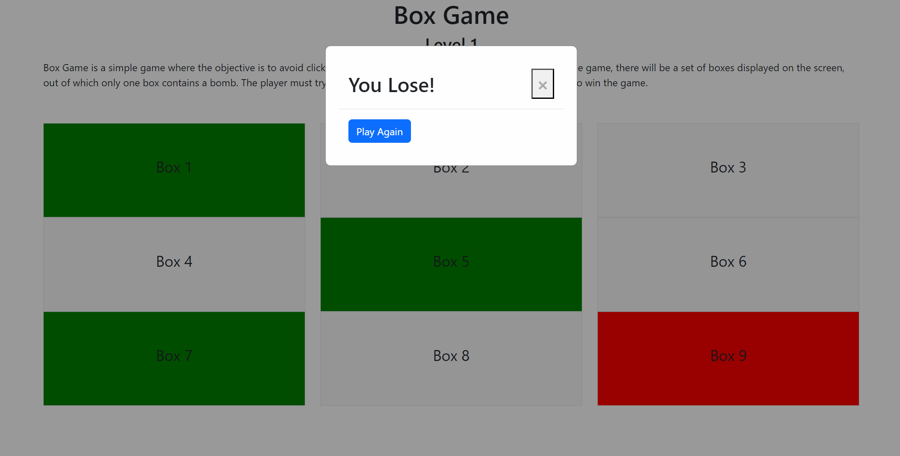

# Box Game

Box Game is a simple game where the objective is to avoid clicking on the box that contains a bomb. In each round of the game, there will be a set of boxes displayed on the screen, out of which only one box contains a bomb. The player must try to click on all the boxes except the one with the bomb to win the game.

## Gameplay

The game consists of a 3x3 grid of boxes. The player must click on each box, except for the one that contains the bomb. If the player clicks on the bomb box, the game is over and they lose. If the player successfully clicks on all boxes except the bomb box, they win.

## Screenshot

## Installation

To play Box Game, simply download or clone the repository and open the `index.html` file in your web browser. The game uses Bootstrap and custom CSS for styling, as well as custom JavaScript for game logic.

## Credits

This game was created by [Ahmed Alsaiqal] using HTML, CSS, and JavaScript.

## Contributing

If you would like to contribute to Box Game, feel free to submit a pull request. All contributions are welcome, including bug fixes, new features, and improvements to the user interface.
